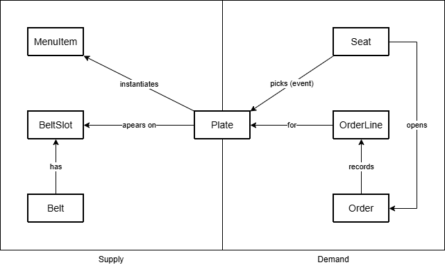
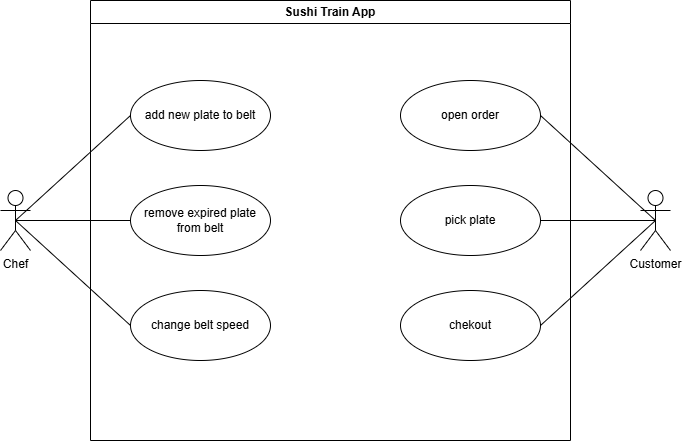

# sushi-train

Application simulating a Sushi Train Restaurant

## Business Object Model

## Use Cases

## ER diagram

erDiagram
MENU_ITEM {
uuid id PK
text name
text default_tier // e.g., green/red/gold
int base_price_yen
timestamptz created_at
}

PLATE {
uuid id PK
uuid menu_item_id FK
text tier_snapshot // snapshot of tier when created
int price_at_creation_yen // optional (nullable)
timestamptz created_at
timestamptz expires_at
text status // ON_BELT, PICKED, EXPIRED
}

BELT {
uuid id PK
text name
int slot_count
int rotation_offset // 0..slot_count-1
int tick_interval_ms
int speed_slots_per_tick // e.g., 1
}

BELT_SLOT {
uuid id PK
uuid belt_id FK
int position_index // fixed 0..slot_count-1
uuid plate_id FK NULL
}

SEAT {
uuid id PK
text label
uuid belt_id FK NULL // optional (for spatial link)
int seat_position_index NULL // slot index it faces
}

"ORDER" {
uuid id PK
uuid seat_id FK
text status // OPEN, CHECKED_OUT, CANCELED
timestamptz created_at
timestamptz closed_at NULL
}

ORDER_LINE {
uuid id PK
uuid order_id FK
uuid plate_id FK
text menu_item_name_snapshot
text tier_snapshot
int price_at_pick_yen
timestamptz picked_at
}

%% Relationships
MENU_ITEM ||--o{ PLATE : "instantiates"
BELT ||--o{ BELT_SLOT : "has"
BELT_SLOT }o--|| PLATE : "holds (0..1)"
SEAT }o--|| BELT : "faces (optional)"
SEAT ||--o{ "ORDER" : "opens"
"ORDER" ||--o{ ORDER_LINE : "contains"
ORDER_LINE }o--|| PLATE : "for plate"
