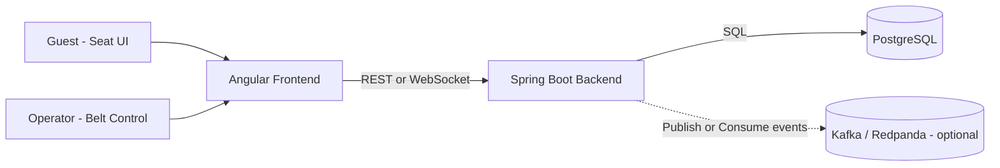
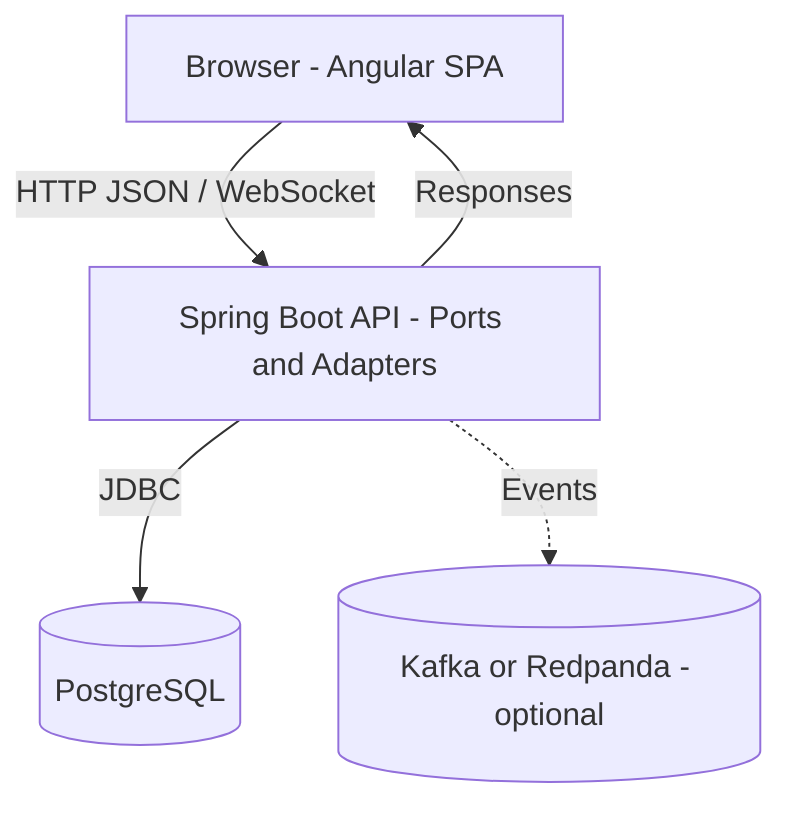
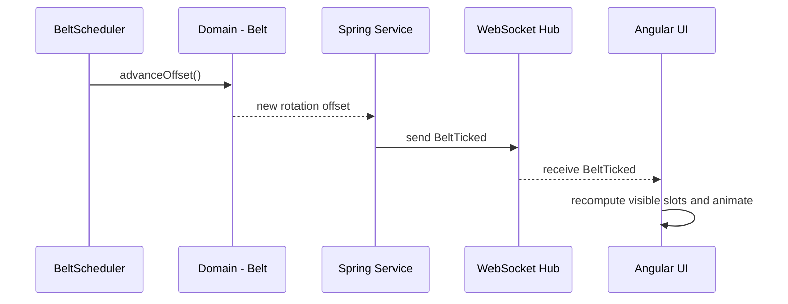
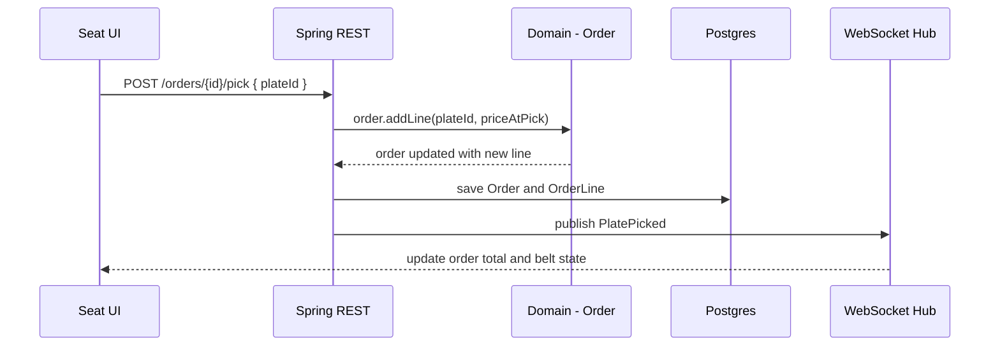
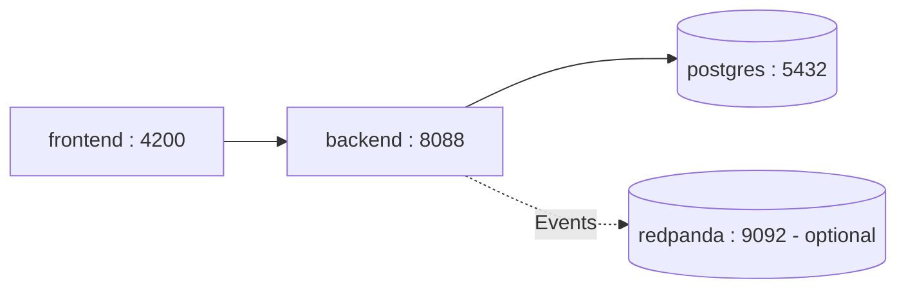

# Sushi-Train — Architecture Overview

This document gives a high-level view of Sushi-Train’s architecture using a simple, C4-style progression:

1. **System Context** — who/what interacts with the system
2. **Containers** — major runtime pieces (frontend, backend, DB, broker)
3. **Key Flows** — how the most important interactions work
4. **Deployment (Local)** — how Docker Compose runs everything
5. **Evolution** — how this scales in later phases

Also see: [Domain Events](./domain-events.md) · [ERD / Domain Model](./domain-model.md)

---

## 1) System Context



Intent: A playful sushi conveyor-belt simulation with a domain-driven core and optional event streaming.

---

## 2) Container View (runtime building blocks)



Key responsibilities:

- **Angular Frontend**: belt and seat UIs, kawaii visuals, realtime updates via WebSocket.
- **Spring Boot Backend**: REST and WS endpoints, domain logic, scheduled belt ticks, event publishing.
- **PostgreSQL**: persistence for menu items, plates, orders, order lines, belt slots.
- **Kafka/Redpanda (optional)**: event backbone for real-time mode and analytics.

---

## 3) Key Flows

### 3.1 Belt movement (rotation offset)



Why offset? Slots stay fixed (0..N-1); movement is a single integer `rotation_offset`. O(1) to advance and easy to scale.

### 3.2 Seat picks a plate



Event source: `PlatePicked` is the core business event; see [Domain Events](./domain-events.md).

---

## 4) Deployment — Local (Docker Compose)



Run locally:

```bash
docker-compose up --build
# Frontend: http://localhost:4200
# Backend:  http://localhost:8088
# Swagger (if enabled): http://localhost:8088/swagger-ui.html
```

Profiles:

- Phase 1: no broker; WebSocket provides live updates.
- Phase 2+: enable broker service and Spring profile `streaming`.

---

## 5) Evolution (Phases)

|             Phase | Focus                      | What changes                                |
| ----------------: | -------------------------- | ------------------------------------------- |
|  **1. Cute Demo** | CRUD + belt scheduler + WS | Minimal adapters; single-node Compose       |
|  **2. Real-Time** | Kafka or Redpanda events   | Outbox producer, WS consumer, dashboards    |
| **3. Stress Lab** | Load, scaling, reliability | Autoscaling, metrics, chaos, analytics sink |
|      **4. Cloud** | Kubernetes deployment      | Manifests or Helm, Prometheus and Grafana   |

Non-breaking design choices: ports and adapters, domain events, rotation offset — all allow incremental adoption of streaming and scaling without refactoring the core.

---

## 6) Technology Choices (why)

- **Hexagonal (Ports and Adapters)**: swap infrastructure (WebSocket vs Kafka) without touching domain.
- **PostgreSQL + Flyway**: robust SQL with migrations; easy to grow analytics later.
- **Angular**: component-driven UI; RxJS for realtime streams.
- **Kafka or Redpanda (optional)**: reliable, replayable event backbone; perfect for Stress Lab.

---

## 7) Cross-cutting Concerns

- **Observability**: Spring Actuator and Micrometer; later Prometheus and Grafana.
- **Testing**: domain unit tests; integration tests with Testcontainers; contract tests for events.
- **Idempotency**: events carry unique `id`; consumers dedupe; consider transactional outbox in Phase 2+.
- **Security (later)**: seat vs operator roles; rate limits on admin actions.

---

## 8) Traceability Map

- **Domain model**: see [ERD / Domain Model](./domain-model.md)
- **Event catalog**: see [Domain Events](./domain-events.md)
- **API surface**: (optional) link to Swagger/OpenAPI
- **Runbook**: (optional) `docs/runbook.md` for commands and gotchas

---

### How to update this page

- Keep diagrams in **Mermaid** for quick edits.
- If you draw in Draw.io or Excalidraw, commit both the **source** and exported **PNG/SVG** in `docs/`.
- Keep links and filenames consistent (`domain-events.md`, `domain-model.md`, etc.).
- Make small PRs: when architecture changes (new topic, new container), update the relevant diagram and add one sentence of context.

---
