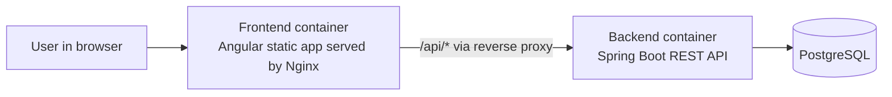

# Sushi-Train Architecture Overview

This document describes the current architecture of Sushi-Train (`v0.2.0`) and the expected evolution path for cloud deployment.

Related docs:
- [Domain Events](./domain-events.md)
- [Domain Model](./domain-model.md)

---

## 1) System Context


```mermaid
flowchart LR
  user[User in browser]
  fe[Frontend container\nAngular static app served by Nginx]
  be[Backend container\nSpring Boot REST API]
  db[(PostgreSQL)]

  user --> fe
  fe -->|/api/* via reverse proxy| be
  be --> db
```

Key point: the browser talks to one frontend origin (`:4200`). Nginx proxies `/api/*` to the backend service in the Docker network.

---

## 2) Runtime Containers (Local Compose)

The root `docker-compose.yml` starts exactly three services:

1. `postgres` (`postgres:17`)
2. `backend` (Spring Boot, Java 25)
3. `frontend` (Angular build + Nginx runtime)

Service dependencies:

- `backend` waits for healthy `postgres`.
- `frontend` waits for healthy `backend`.

Health checks:

- Backend: `GET /actuator/health`
- Postgres: `pg_isready`

---

## 3) API and Realtime Pattern

### 3.1 Command and Query

The frontend uses REST endpoints for snapshots and commands, for example:

- `GET /api/v1/belts/{id}/snapshot`
- `GET /api/v1/belts/{id}/seats`
- `POST /api/v1/belts/{id}/plates`
- `PATCH /api/v1/belts/{id}`
- `POST /api/v1/seats/{id}/occupy`
- `POST /api/v1/seats/{id}/order-lines`
- `POST /api/v1/seats/{id}/checkout`

### 3.2 Realtime updates

Realtime UI refresh notifications use SSE:

- Stream endpoint: `GET /api/v1/belts/{id}/events` (`text/event-stream`)
- Current event names:
  - `connected` (on initial subscription)
  - `belt-state-changed` (after write actions that affect belt/seat view)

The SSE event payload (`BeltUiEvent`) is lightweight:

```json
{
  "eventId": "UUID",
  "beltId": "UUID",
  "type": "belt-state-changed",
  "occurredAt": "2026-03-22T10:00:00Z"
}
```

The frontend treats SSE as an invalidation signal and refreshes snapshot/seat data via REST. If SSE is unavailable, a polling fallback keeps the UI usable.

---

## 4) Domain and Persistence Shape

The backend follows a layered style with a domain-focused core:

- REST controllers in `interfaces/rest`
- application services orchestrating use cases
- domain model with business rules
- JPA repositories/adapters

Database schema is managed via Flyway migrations (`V1..V3`) and includes:

- `belt`, `belt_slot`, `seat`
- `menu_item`, `plate`
- `orders`, `order_line`

---

## 5) Local Deployment

Standard startup:

```bash
docker compose up --build
```

Default local URLs:

- Frontend: `http://localhost:4200`
- Backend API: `http://localhost:8088/api/v1`
- Swagger UI: `http://localhost:8088/swagger-ui/index.html`
- Health: `http://localhost:8088/actuator/health`

Environment is configured through `.env` (see `.env.example`).

---

## 6) Cloud Adaptation Path

The current setup is intentionally close to a cloud-ready split:

1. Managed Postgres service
2. Backend container service
3. Frontend static hosting or frontend container service

Recommended next steps for production:

- Externalize secrets (do not store credentials in `.env`)
- Add managed TLS and ingress
- Add centralized logs and metrics
- Add CI pipeline that builds and publishes backend/frontend images

Kafka/Redpanda can be added later for asynchronous domain event distribution, but it is not required for the current SSE-driven UI model.
