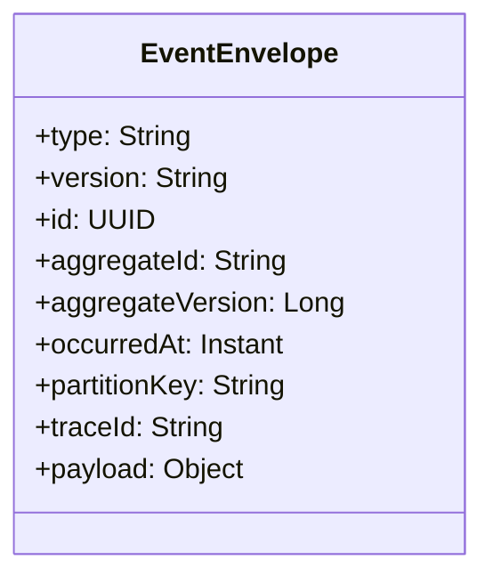
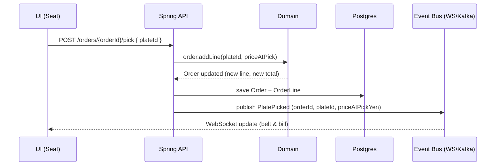

# Sushi Train — Domain Events

This document defines the event model used across the Sushi Train application. It’s designed to work for **Phase 1 (Cute Demo)** without a real broker and to plug into **Phase 2 (Real-Time)** with Kafka/Redpanda—without changing the domain code.

---

## 1) Envelope (common event shape)

All domain events share a standard envelope. The `payload` contains the event-specific fields.



**Field purpose**

- **aggregateId**: the business identity whose timeline this event belongs to (keeps per-aggregate ordering).
- **aggregateVersion**: increments per aggregate event (detects gaps/duplicates; optional in Phase 1).
- **partitionKey**: determines broker partition; use the same value for all events of an aggregate.
- **traceId**: ties UI → API → broker → consumer together for debugging.

---

## 2) Event catalog (minimal set)

| Event             | Aggregate    | Partition key | Purpose                                              |
| ----------------- | ------------ | ------------- | ---------------------------------------------------- |
| `MenuItemCreated` | `menuItemId` | `menuItemId`  | Catalog item added (name, default tier, base price). |
| `PlateCreated`    | `plateId`    | `plateId`     | Chef placed a plate on the belt (supply appears).    |
| `PlateExpired`    | `plateId`    | `plateId`     | Plate became unavailable (age/manual).               |
| `BeltTicked`      | `beltId`     | `beltId`      | Rotation offset advanced; drives movement.           |
| `OrderOpened`     | `orderId`    | `orderId`     | Seat opened a new order.                             |
| `PlatePicked`     | `orderId`    | `orderId`     | Seat picked a plate → creates an OrderLine.          |
| `OrderCheckedOut` | `orderId`    | `orderId`     | Order closed with totals (¥).                        |

> Rule of thumb: ordering events partition by `orderId`, plate lifecycle by `plateId`, belt events by `beltId`.

---

## 3) Flow example (picking a plate)



---

## 4) Event specs (v1)

### 4.1 MenuItemCreated (v1)

- **Aggregate**: `menuItemId`
- **When**: New catalog item is defined.
- **Payload**

```json
{
  "menuItemId": "mi-001",
  "name": "Salmon Nigiri",
  "defaultTier": "green",
  "basePriceYen": 120
}
```

### 4.2 PlateCreated (v1)

- **Aggregate**: `plateId`
- **When**: Chef adds a plate to the belt.
- **Payload**

```json
{
  "plateId": "plate-42",
  "menuItemId": "mi-001",
  "tierSnapshot": "green",
  "priceAtCreationYen": 120,
  "createdAt": "2025-11-03T11:22:01Z",
  "expiresAt": "2025-11-03T11:52:01Z"
}
```

### 4.3 PlateExpired (v1)

- **Aggregate**: `plateId`
- **When**: Plate is no longer available (time or manual removal).
- **Payload**

```json
{
  "plateId": "plate-42",
  "expiredAt": "2025-11-03T11:50:57Z",
  "reason": "AGE"
}
```

### 4.4 BeltTicked (v1)

- **Aggregate**: `beltId`
- **When**: A tick advanced the rotation offset.
- **Payload**

```json
{
  "beltId": "belt-1",
  "tick": 10234,
  "newRotationOffset": 57
}
```

### 4.5 OrderOpened (v1)

- **Aggregate**: `orderId`
- **When**: A seat opens an order.
- **Payload**

```json
{
  "orderId": "order-7d2a",
  "seatId": "seat-A1",
  "openedAt": "2025-11-03T11:20:00Z"
}
```

### 4.6 PlatePicked (v1)

- **Aggregate**: `orderId`
- **When**: Seat picks a plate; creates an OrderLine.
- **Payload**

```json
{
  "orderId": "order-7d2a",
  "seatId": "seat-A1",
  "plateId": "plate-42",
  "priceAtPickYen": 120,
  "pickedAt": "2025-11-03T11:22:05Z"
}
```

### 4.7 OrderCheckedOut (v1)

- **Aggregate**: `orderId`
- **When**: Order is closed and billed.
- **Payload**

```json
{
  "orderId": "order-7d2a",
  "seatId": "seat-A1",
  "totalYen": 720,
  "itemCount": 6,
  "checkedOutAt": "2025-11-03T11:45:00Z"
}
```

---

## 5) Envelope example (full)

```json
{
  "type": "PlatePicked",
  "version": "v1",
  "id": "d7b2f0f7-3a5e-4f6e-91ab-6dd3b5e3c3d2",
  "aggregateId": "order-7d2a",
  "aggregateVersion": 12,
  "occurredAt": "2025-11-03T11:22:05Z",
  "partitionKey": "order-7d2a",
  "traceId": "req-9b1c",
  "payload": {
    "orderId": "order-7d2a",
    "seatId": "seat-A1",
    "plateId": "plate-42",
    "priceAtPickYen": 120,
    "pickedAt": "2025-11-03T11:22:05Z"
  }
}
```

---

## 6) Topics (now vs later)

- **Phase 1 (demo)**: single topic `sushi.events` (dispatch by `type`).
- **Phase 2 (clean)**:
  - `sushi.catalog` → `MenuItemCreated`, …
  - `sushi.plate` → `PlateCreated`, `PlateExpired`
  - `sushi.belt` → `BeltTicked`, `BeltSpeedChanged`
  - `sushi.order` → `OrderOpened`, `PlatePicked`, `OrderCheckedOut`

**Partitioning**

- Keep all events of an aggregate in the same partition:
  - `partitionKey = orderId` for order events,
  - `partitionKey = plateId` for plate events,
  - `partitionKey = beltId` for belt events.

---

## 7) Conventions

- Names use **PastTense** (`PlatePicked`).
- All money fields are **integer Yen**.
- **Idempotency**: consumers de-dupe on `id`; side effects must be safe on repeat.
- **Versioning**: bump `version` when payload shape changes; keep old handlers during transition.
- **Ordering**: rely on per-aggregate partitioning; optionally use `aggregateVersion` for checks.

---

## 8) Testing notes

- Unit test domain services with **in-memory** publisher (no broker).
- Contract test event shapes (JSON) with golden files or JSON schema.
- Integration test a “happy path”: `OrderOpened` → `PlatePicked` → `OrderCheckedOut`.
- If using Kafka in Phase 2, verify partitioning with Redpanda Console or Kafka tooling.

---

## 9) FAQ

**Q: Do I need `aggregateVersion` in Phase 1?**  
A: No — it’s optional. Add it when you need replay/concurrency checks.

**Q: Where do I compute belt movement?**  
A: Emit `BeltTicked` and update `rotationOffset` in memory; use the offset formula in UI. Persist occasionally if you want recovery across restarts.

---

_This document lives at `docs/events.md`. Keep it in sync with the ERD and Flyway migrations._
