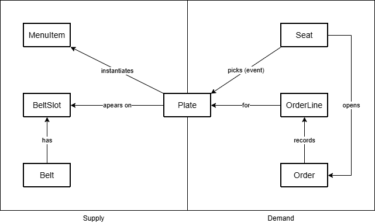
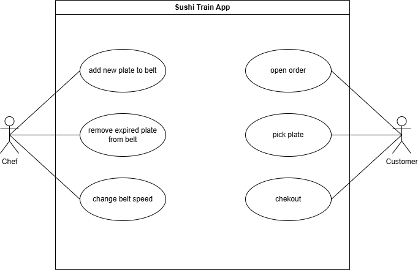
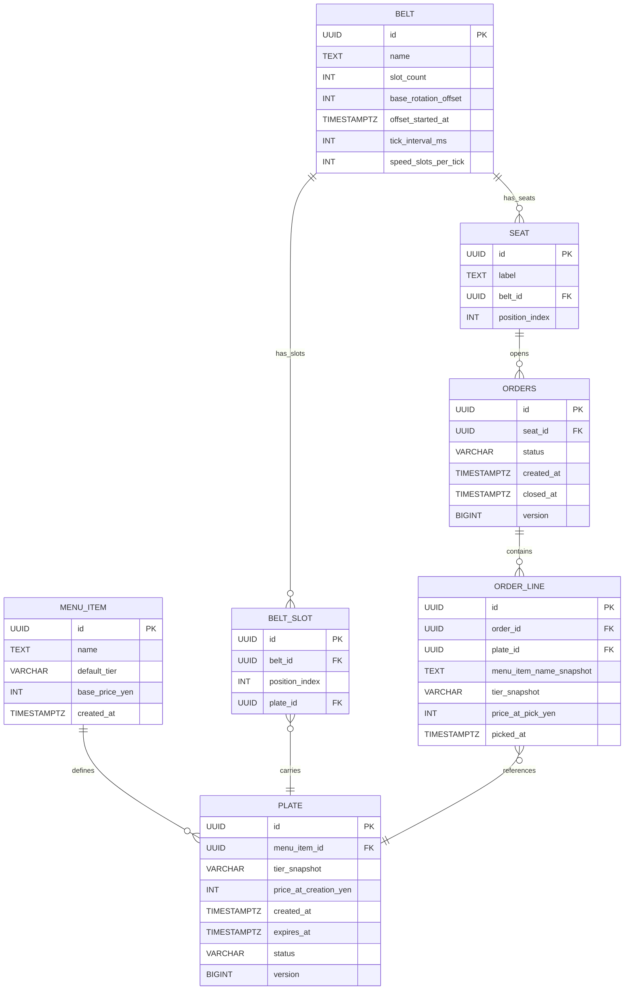

# Domain Model

This document reflects the persisted model defined by Flyway migrations (`V1__init_schema.sql`, `V2__seed_menu_items.sql`, `V3__seed_belt.sql`).

## Business Objects

## Use Cases

## Entity Relationships

## Key Constraints

- `menu_item.name` is unique.
- One open order per seat (`uk_orders_open_per_seat` partial unique index).
- One plate can only be in one order line (`order_line.plate_id` unique).
- One plate can only occupy one belt slot at a time (`belt_slot.plate_id` unique).
- `belt_slot` uniqueness by `(belt_id, position_index)`.
- `seat` uniqueness by `(belt_id, label)` and `(belt_id, position_index)`.

## Seeded Baseline Data

- One belt named `Main Belt`.
- 192 belt slots (`position_index` `0..191`).
- 24 seats (`label` `1..24`) spaced around the belt.
- Menu items seeded with deterministic UUIDv5 values.
